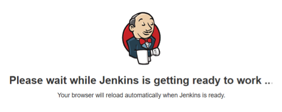
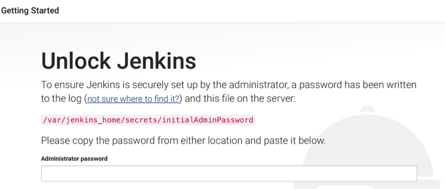
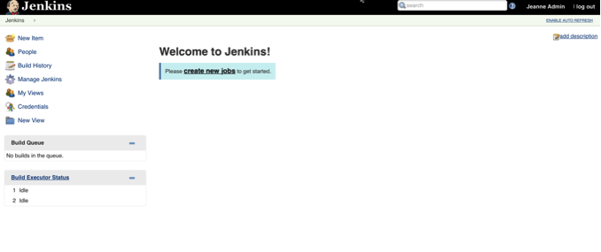
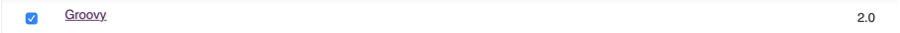
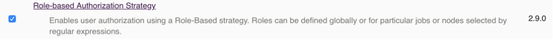
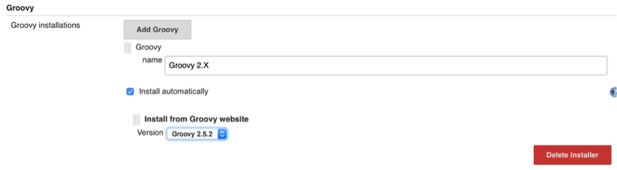

## Step 1: Start Nexus and Jenkins

In this lab, we use basic Docker to make setup simple. We do not set up a volume to persist the data since the emphasis is Groovy setup. (We will start Sonar at the end after stopping Nexus and Jenkins to limit the laptop resources needed by this lab)

### 1.1 - Create network bridge

Create network for services to communicate across:

**docker network create hol-network**

### 1.2 - Install Nexus

At the command line, run:

**docker run -d -p 8081:8081 --name nexus --network hol-network sonatype/nexus3:3.13.0**

_Note: If you&#39;ve run it in the past, type_ **docker start nexus** _instead_

Validation

In a browser, go to [http://localhost:8081](http://localhost:8081). If you do not see Nexus, wait 15 seconds and try again. (It could take up to a minute)

### 1.3 - Install Jenkins

At the command line, run

**docker run -d -p 8080:8080 --name jenkins --network hol-network jenkins/jenkins:2.146**

_Note: If you&#39;ve run it in the past, type_ **docker start jenkins** _instead_

### 1.4 – Verify Jenkins is Running

1. In a browser, go to [http://localhost:8080](http://localhost:8080)
2. You should see the following screen:
 

1. Following this page, you will see a page asking for the administrator password.  Once you see this, you can continue to the next step.

If you don&#39;t see this screen, you either do not have Jenkins running or may have sa different service running on port 8080.

### 1.5 - Unlock Jenkins

1. At the command line, run:
**docker exec -it jenkins bash**

1. Print the password:
**cat /var/jenkins\_home/secrets/initialAdminPassword**

1. Back in your browser visit [http://localhost:8080](http://localhost:8080) again.
 

1. Paste in the password and click continue

1. Allow Jenkins to install the suggested plugins
  1. Failure to install the suggested plugins will cause problems later in the lab.

1. In the command line window, type exit to get out of bash.

1. Pick a username/password for your admin test user. Enter all the fields and click &quot;Save and Continue&quot;

1. Click to Finish

1. Click &quot;Start using Jenkins&quot;
  

### 1.6 – Add additional plugins

We need two additional plugins to create jobs for this lab.

1. In the left navigation, click &quot;Manage Jenkins&quot;

1. Click &quot;Manage Plugins&quot;

1. Click the &quot;Available&quot; tab

1. Select **Groovy** , as well as the **Role-based Authorization Strategy** plugin. We&#39;ll use that one later. 
 

1. Click the button &quot;Download now and install after restart&quot;

1. Check to restart
 

1. Refresh the page after a few seconds (or click &quot;Enable Auto Refresh&quot; on top)

1. Login as admin

1. Click &quot;Manage Jenkins&quot; again

1. Click &quot;Global Tool Configuration&quot;

1. Click &quot;Add Groovy&quot;

1. Set the name to &quot;Groovy 2.X&quot;. Leave the version as the default. (This gives us a slightly different of Groovy, but this is fine as long as we stay on the 2.X series.)

1. Click &quot;Save&quot; (scroll down/right if you don&#39;t see the save button.