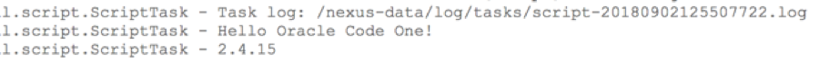

## Step 3: Basic Nexus Scripting

### 3.1 - Run your first Groovy script in Nexus

Let&#39;s confirm what version of Groovy is being used.

1. Login to Nexus (localhost:8081 or the port of your choosing) using admin/admin123.

1. Click the gear icon to get the administration options
 

1. In the left navigation, scroll down and choose the last line &quot;Tasks&quot;

1. Click &quot;Create Task&quot;

1. Choose &quot;Admin - Execute Script&quot;

1. Enter a task name.

1. For the script source, enter:
```groovy
log.info 'Hello Oracle Code One!'
log.info GroovySystem.version
```

8. For task frequency, choose &quot;Manual&quot;

1. Click &quot;Create Task&quot;

1. Click the task name

1. Click Run


1. Click &quot;Yes&quot; to confirm

1. Click Summary tab. Depending on how fast you are, it will either say Running or Waiting. Refresh if it is still running to confirm it completes.


1. In the left navigation go to Support -> Logging -> Log Viewer

1. Notice your logging is there:
 

1. Note that this is not the same version as Jenkins used; but it is close enough to not cause us difficulties.

### 3.2 - Looking in the task log on the command line

1. In a new command line tab/window, run:

**docker exec -it nexus bash**

2. Print the log file:

````
cd /nexus-data/log/tasks
ls
cat \*.log
````

3. Confirm you see 8 lines.

1. Now can you find the main log file. If so, run

**tail –f nexus.log**

5. In your browser, re-run your Groovy task. How many lines do you see added to the tail output? It&#39;s not 8 lines. Can you figure out the difference between the nexus log and task log?

### 3.3 - Writing your own script in Nexus

Now try to write your own Groovy script that prints out a countdown. The output includes the arrows and should be:

--\> 10
--\> 9
--\> 8
--\> 7
--\> 6
--\> 5
--\> 4
--\> 3
--\> 2
--\> 1
Blast off!

Tip for Groovy developers: the log.info method takes a Java String and not a GString.

Tip for Java developers: you can use groovy on your machine or the Jenkins scripting console to interactively nail down the syntax. Or look at the solution guide.

Check the output in both a browser (nexus log) and command line (task log).

**Challenge** : can you write the Groovy code in two lines of no more than 40 characters each? You can use [https://www.lettercount.com](https://www.lettercount.com) to check the number of characters.

### 3.4 - log vs println

1. In your prior example, change **log.info** to **println**

1. Run the task

1. Check the output in both the browser and command line task log. Where do you see it?

If you don't see the expected output, see the command in the solution guide.