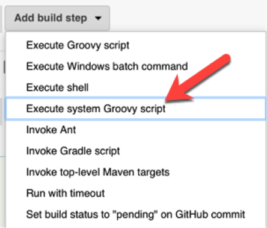

## Step 4: Jenkins System Scripting

We are going to setup Jenkins to have different teams and permissions for each.

- The Open Ospreys allow all Jenkins users to see their projects. Olivia and Owen are on this team.

- The Secret Sea Lions only allow their team members to see their projects. Sam and Sophia are on this team.

It&#39;s easiest to start in the scripting console and create our script interactively. Once we know the syntax and APIs, we&#39;ll delete that configuration. Then we will run the Groovy code through a job to be repeatable.

Note: If you are using LDAP/AD and/or Jenkins Enterprise on your real projects, you&#39;ll have more powerful access control options available to you.

### 4.1 - Tools for finding methods

Note that Jenkins was an offshoot of Hudson. The source code betrays this fact and still has some Hudson class/package names.

#### Tool 1 – JavaDoc

1. In the Jenkins scripting console, write the following code

````groovy
def instance = Jenkins.getInstance()
println instance.class
````

1. This prints out

class hudson.model.Hudson

1. Knowing the class name allows you to look at the JavaDoc for Jenkins core along with popular plugins:

[https://javadoc.jenkins.io](https://javadoc.jenkins.io)

[https://javadoc.jenkins.io/plugin](https://javadoc.jenkins.io/plugin)

#### Tool 2 – Groovy

1. Now write the following code

````groovy
def instance = Jenkins.getInstance()
println instance.metaClass.methods\*.name.sort().unique()
````

1. The metaClass methods approach is a quick way to find out what methods are available on an object you currently have.

1. You can even see the method signatures:

````groovy
def instance = Jenkins.getInstance()
println instance.metaClass.methods
````

#### Tool 3 – Google

Seriously. People have posted many Groovy scripts online that you can either use directly or make minor edits to.

### 4.2 - Creating a user

To help us keep track of who is who, we are going to give our users the same username and password. Obviously, don&#39;t do this on your real Jenkins!

1. Users are created in security realms. Run this code in the &quot;Script Console&quot; to create a user.  Remember, the &quot;Script Console&quot;  is available under &quot;Manage Jenkins&quot;.

````groovy
def instance = Jenkins.getInstance()
def realm = Jenkins.getInstance().securityRealm
realm.createAccount('olivia', 'olivia')
instance.save()
println 'Done'
````
2. In the left navigation, click &quot;People&quot; and note Olivia is there now.

1. Click her id and then click &quot;Delete&quot; from the left navigation.

1. Create a new freestyle job

1. This time add a System Groovy build step


1. Add three more lines of code so Owen, Sam and Sophia get accounts.

Note: Since we are now running in a job, we need to explicitly include the package for Jenkins. The console assumed this for you. ( **import jenkins.model.Jenkins** )

7. Run the job.

1. Go to &quot;People&quot; in the left navigation and confirm the accounts were added.

### 4.3 - Setting up the authorization strategy

Jenkins has a number of authorization strategies. Since the Ospreys and Sea Lions have different requirements, we are using the project level authorization strategy. We set up the admin and general user settings. We will also set up roles so the right users can see each project.

1. Create another Jenkins job called create-auth-strategy

1. In the Groovy console section, paste the code from

[https://github.com/boyarsky/OracleCodeOne2018-HOL-Automating-Stack-Groovy/blob/master/jenkinsScripts/auth.groovy](https://github.com/boyarsky/OracleCodeOne2018-HOL-Automating-Stack-Groovy/blob/master/jenkinsScripts/auth.groovy)

3. If your administrator username is \*not\* admin, then you need to change the second &#39;admin&#39; script on line 14, such as was done below:

auth.doAssignRole(&#39;globalRoles&#39;, &#39;admin&#39;, &#39;melissa&#39;)

**Failure to do so could result in your having reset your Jenkins permissions (see Appendix II) and/or start over!**

4. Run the job

1. Look at [http://localhost:8080/role-strategy/manage-roles](http://localhost:8080/role-strategy/manage-roles)

1. Note that the ospreys now have team permissions.

1. Update the groovy code to set up the sea lions. Their team project prefix is sea-lion.

1. Update the groovy code from Step 6 to add Sophia and Sam to this new team. (remember that saving must be the last statement).
  1. Do not remove the existing statements for ospreys/Olivia/Owen from the script, as running the script replaces the previous authorization entirely.

1. Re-run the job and confirm:
  1. The assigned roles table has a column for the sea-lions. The rows for Sam and Sophia should have one checkbox selected on each.
  2. The items role table has rows for Sam and Sophia. Their rows should have two checkboxes selected on each.

_Note:_ Another option is to have Jenkins pull the project from GitHub and run the Groovy code as a script. However, this triggers the script security plugin and requires an extra step. Since this is a conference and not a system we are maintaining, we optimized. The effort to setup script security properly is more than the effort to copy/paste this config.

Jeanne&#39;s rant about the script security plugin is here:

[https://www.selikoff.net/2018/09/02/a-rant-about-jenkins-script-security/](https://www.selikoff.net/2018/09/02/a-rant-about-jenkins-script-security/)