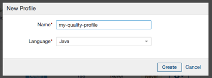
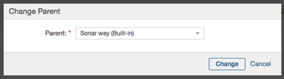
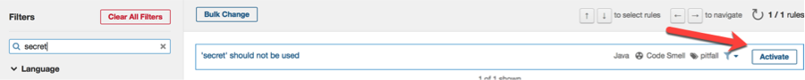
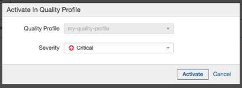
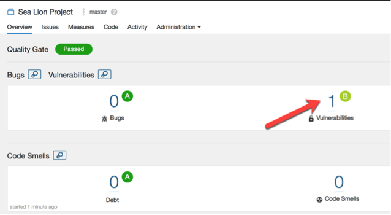
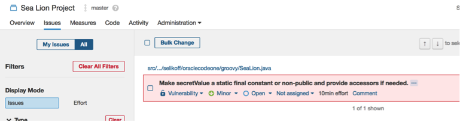

## Step 8 – Creating a custom SonarQube rule

The company is concerned about the Sea Lions committing trade secrets. In true Dilbert fashion, they decided the solution was to ban the word &quot;secret&quot; from method and variable names.

Conveniently, we had a developer (Jeanne) handy to write the rule. You can browse the source code at

[https://github.com/boyarsky/OracleCodeOne2018-HOL-Automating-Stack-Groovy/tree/master/sonar-custom-rule](https://github.com/boyarsky/OracleCodeOne2018-HOL-Automating-Stack-Groovy/tree/master/sonar-custom-rule)

(SecretNotAllowedRule.java is the most interesting class)

### 8.1 - Deploying a custom rule

1. Copy the snapshot jar of this rule to a directory on your machine. You can use Maven to build sonar-custom-rule or use the pre-built version from

[https://github.com/boyarsky/OracleCodeOne2018-HOL-Automating-Stack-Groovy/blob/master/sonar-custom-rule-0.0.1-SNAPSHOT.jar](https://github.com/boyarsky/OracleCodeOne2018-HOL-Automating-Stack-Groovy/blob/master/sonar-custom-rule-0.0.1-SNAPSHOT.jar)

2. cd to the directory where you downloaded (or built) the jar.

1. docker cp sonar-custom-rule-0.0.1-SNAPSHOT.jar sonarqube:/opt/sonarqube/extensions/plugins/sonar-custom-rule-0.0.1-SNAPSHOT.jar

1. docker restart sonarqube

### 8.2 - Add this rule to the default quality profile

1. Go to [http://localhost:9000](http://localhost:9000) (remember it could take a minute so refresh if you don&#39;t see the screen)

1. Login (admin/admin)

1. Close the tutorial popup by clicking the Skip button

1. Click &quot;Quality Profiles&quot; in the top navigation

1. Click &quot;Create&quot; on the upper right

1. Enter a name of your choosing and select &quot;Java&quot; from the pulldown
 

1. Click &quot;Create&quot;

1. Note your quality profile has zero rules

1. Click &quot;Change parent&quot; and choose the &quot;Sonar way (Built-in)&quot;
 

1. Note how many rules are in the quality profile now. (It was 299 active rules when we tested)

1. Click &quot;Activate More&quot;

1. Search for &quot;secret&quot;
 

1. Click &quot;Activate&quot;

1. Leave the default of &quot;Critical&quot; and choose &quot;Activate&quot; again.
 

1. Click &quot;Quality Profiles&quot; in the top navigation and observe one more rule is active.

### 8.3 - Run a scan with this custom rule

For this step you will need to have completed Section 7.1 - &quot;Download and Build sea-lion Project&quot;, in which the sea-lion project was built using the local Nexus repository.

The sea-lion-project directory referred to in Steps 5 and 6 assume you are running it in the directory where the sea-lions project was previously built.

1. Download the CLI for your operating system from
[https://docs.sonarqube.org/display/SCAN/Analyzing+with+SonarQube+Scanner](https://docs.sonarqube.org/display/SCAN/Analyzing+with+SonarQube+Scanner)

1. Extract the files to a new directory and make sure to write down where you placed it, since you will need the full path later, such as:

~/Downloads/sonar-scanner-1.2.3

3. Navigate to the /conf directory of the extracted files, open the sonar-scanner.properties file with your favorite text editor, and uncomment the # in the following line:

sonar.host.url=http://localhost:9000

4. Save the properties file.

1. Navigate (cd) into the sea-lion-project folder

1. Run the /bin/sonar-scanner executable from the extracted folder in the sea-lion-project directory.  You&#39;ll need the full path you created in Step 2.  The following example demonstrates this, although your paths may vary locally:

$ cd OracleCodeOne2018-HOL-Automating-Stack-

Groovy/sea-lion-project

$ ~/Downloads/sonar-scanner-1.2.3_/bin/sonar-scanner_

7. The process should finish with the message EXECUTION SUCCESS.

1. Go back into Sonar in the browser and search for &quot;sea lion&quot; in the top-right search box.  Select &quot;Sea Lion Project&quot;.

1. Go to the project and note that now there is one vulnerability.
 

1. Click it to see the details. It&#39;s our &#39;secret&#39; rule!
 