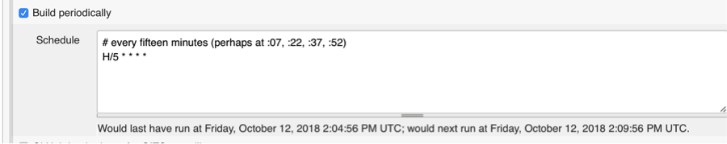

## Step 9 – Extra credit in Jenkins (Optional)

We have a security hole in the design here. Anyone can create any job they want. While solving this problem is out of scope for the lab, let&#39;s deal with one piece of it. The task is to write Groovy code to ensure that only jobs with the prefix &quot;osprey&quot; build the osprey-project and only jobs with the prefix &quot;sea-lion&quot; build the sea-lion-project.

This one is extra credit so it comes with less instructions.

1. Stop the Sonar container

1. Restart the Jenkins container

1. In the Jenkins Groovy console, write a script to check this. (The Groovy is in the solution guide. While we hinted at the knowledge to write this in the lab, it takes more than 2 hours to be able to build it quickly.  We left this as optional to write in case students came in with experience writing Jenkins scripts or managed to get through all the above really fast!)

1. Create a Jenkins FreeStyle job that includes this a Groovy System build step with this code.

1. Add a build trigger to this job so it sruns every 5 minutes. Note that Jenkins tells you when the build will next run so you can see if you did it right:
 

1. Try creating a new project called &quot;osprey-invalid-permissions&quot;. Instead of choosing &quot;FreeStyle job&quot;, scroll down and make a copy of sea-lion-project. Click save for that new project.

1. See that your new validator project fails. (Feel free to disable the validator project after it fails so it doesn&#39;t keep running every 5 minutes.)

While this doesn&#39;t solve the actual security problem, it at least tells someone about it. (or it would, if we had build notifications set up). So you&#39;ve made a toy example on your machine a bit safer :).

